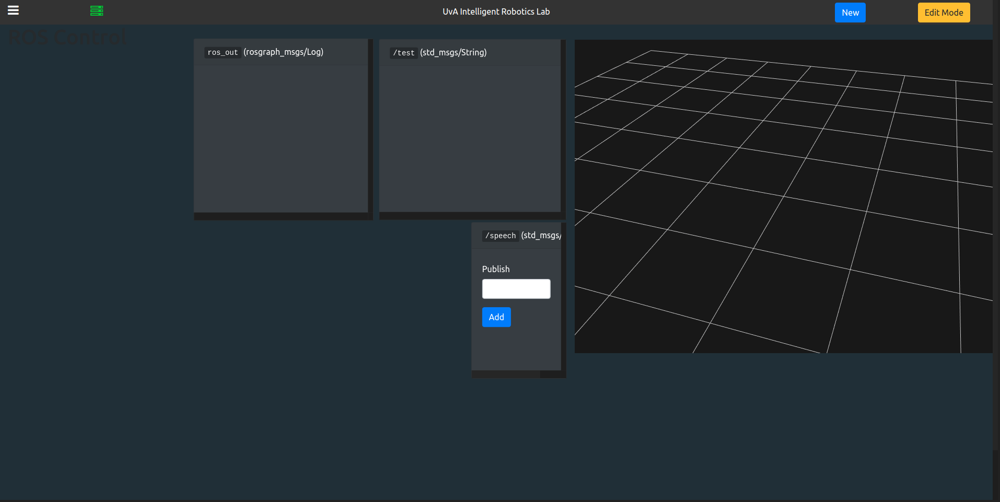
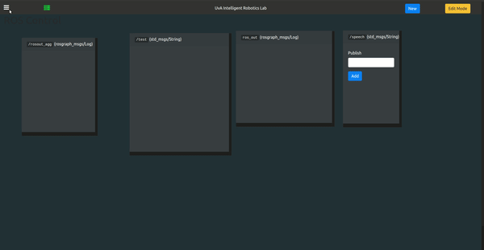

UvA-robotics Dashboard
======
This is a web user interface for our ROS-enabled robots. You can drag and drop panels which you can use to publish/subscribe to nodes. It also uses the tools available from ROS Web Tools to run simulations inside the browser.</br></br>

It uses ROS Bridge (websockets) to communicate.</br>
This is still in heavy development.


</br></br>



## Usage
```
npm install
npm run build && nodemon server.js

roscore
rosrun rosbridge_server rosbridge_websocket
```
